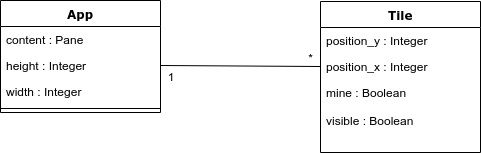
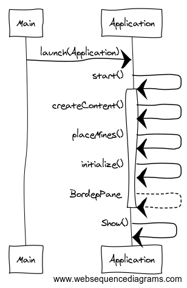

<h1>Arkkitehtuurikuvaus</h1>

<h3>Rakenne</h3>
Pakkaus minesweeper sisältää käyttöliittymän ja sen toiminnot, sekä ohjelman käynnistävän main luokan.

<h3>Käyttöliittymä</h3>
Käyttöliittymä sisältää yhden päänäkymän, jossa peliä pelataan, sekä neljä muuta näkymää:

- Voittoruutu
- Uusi ennätys
- Tietojen syöttäminen
- Leaderboard

Näkymien vaihto on toteutettu käyttöliittymään, jossa eri nappien painallusten kuuntelu aiheuttaa näkymän vaihdoksen.

<h3>Sovelluslogiikka</h3>

Sovelluksen muodostaa kokonaisuudessaan luokka <a href="https://github.com/Jimmeeee/ot-harjoitustyo/blob/master/Minesweeper/src/main/java/com/mycompany/minesweeper/App.java">App</a> ja luokka <a href="https://github.com/Jimmeeee/ot-harjoitustyo/blob/master/Minesweeper/src/main/java/com/mycompany/minesweeper/Tile.java">Tile</a>.
 

<h3>Tietojen tallennus</h3>
Pakkauksen minesweeper luokka App huolehtii tietojen tallettamisesta tietokantaan _leaderboard.mv.db_. Tietokannassa on kolme taulua, joissa jokaisella on sarakkeet _nimi_ ja _score_. Uudet highscoret talletetaan tietokannan tauluun pelin vaikeusasteen perusteella(kolme vaikeusastetta). 

<h5>Ohjelman käyttöliittymän luominen</h5>

<h3>Ohjelman rakenteeseen jääneet heikkoudet</h3>
Ohjelman kaikki kolme luokkaa sijaitsevat samassa pakkauksessa. Olisi hyvä erotella omiin pakkauksiin. Myös käyttöliittymän omaava luokka käsittelee sovelluslogiikkaa, tämä olisi hyvä hoitaa omassa luokassaan. Luokka ja pakkausrakennetta olisi tullut alusta asti tehdä hieman toisin, sillä jälkikäteen niiden muuttaminen on mahdottomuus, alussa aikaa kuitenkin kului javafx:n opetteluun ja toiminnallisuuksien toteuttamiseen.

Käyttöliittymän rakenteen ohjelmalliseen määrittelyyn olisi voinut käyttää JXML- määrittelyä, jotta tapahtumakäsittelijät eivät hukkuisi sovelluslogiikan ja käyttöliittymän sekaan.
