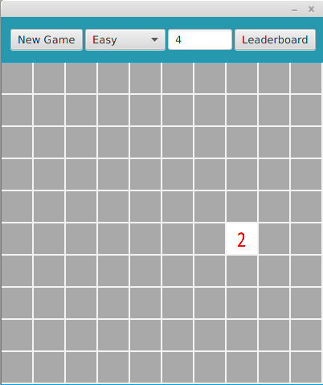

<h2>Käyttöohje</h2>

Lataa tiedosto Minesweeper.jar.

<h3>Konfigurointi</h3>
Ohjelma olettaa, että sen kanssa samassa hakemistossa sijaitsevat kansio <code>css</code> ja tiedostot: <code>leaderboard.mv.db</code> sekä <code>leaderboard.trace.db</code>

<h3>Ohjelman käynnistäminen</h3>

Ohjelma käynnistetään komennolla

<code>java -jar Minesweeper.jar</code>

<h3>Pelin aloittaminen</h3>

Sovellus käynnistyy pelinäkymään.

Aloita peli painamalla ruutua hiiren vasemmalla painikkeella. 
Sekuntikello käynnistyy ja painettu laatta aukeaa.

