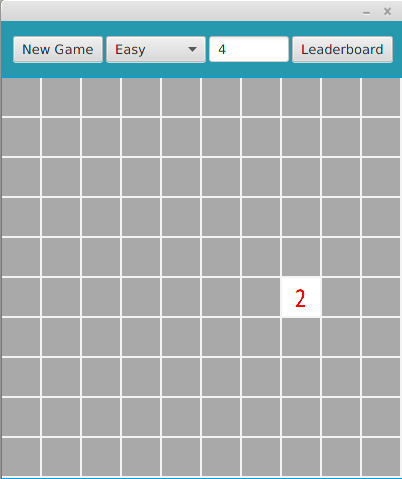
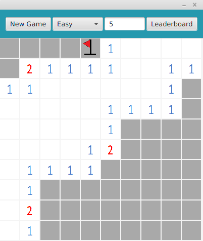
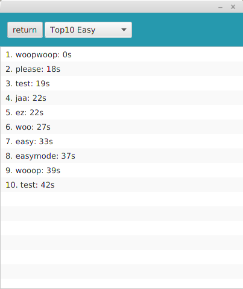
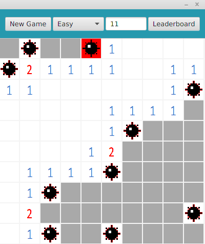

<h2>Käyttöohje</h2>

Lataa tiedosto Minesweeper.jar.

<h3>Konfigurointi</h3>
Ohjelma olettaa, että sen kanssa samassa hakemistossa sijaitsevat kansio <code>css</code> ja tiedostot: <code>leaderboard.mv.db</code> sekä <code>leaderboard.trace.db</code>

<h3>Ohjelman käynnistäminen</h3>

Ohjelma käynnistetään komennolla

<code>java -jar Minesweeper.jar</code>

<h3>Pelin aloittaminen</h3>

Sovellus käynnistyy pelinäkymään.

Aloita peli painamalla ruutua hiiren vasemmalla painikkeella. 
Sekuntikello käynnistyy ja painettu laatta aukeaa.
Vaikeusastetta voi vaihtaa yläpalkista kohdasta "Easy".
Vaikeusasteita on "Easy", "Medium" ja "Hard". Vaikeusasteen valinnan jälkeen tulee painaa nappia "New Game".

<h3>Miinan merkkaaminen</h3>

Painamalla avaamatonta ruutua hiiren oikealla painikkeella voit asettaa ja poistaa lipun, jonka tarkoituksena on merkata miinoja.

<h3>Leadeboard</h3>

Painamalla aloitusnäkymästä nappia "Leaderboard", pääsee tarkastelemaan parhaita voittoaikoja vaikeusasteen mukaan.

<h3>Pelin loppuminen</h3>

Peli loppuu, kun pelaaja on avannut kaikki miinattomat laatat tai pelaajan osuessa miinaan, jolloin painettu miina näkyy punaisella taustalla, ja muiden miinojen sijainti valkoisella taustalla. Uuden pelin saa aloitettua painamalla "New Game".

