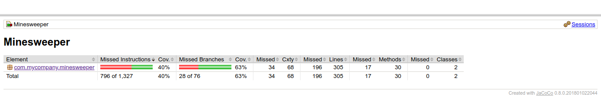

<h1>Testausdokumentti</h1>

Ohjelmaa on testattu yksikkötestein JUnitilla.

<h3>Testikattavuus</h3>

<h3>Yksikkötestaus ja havaitut ongelmat</h3>

Luokkia App ja Tile toimivuutta on testattu yksikkötestein. Testit kattavat yksinkertaisten metodien ja luokkien attribuuttien testauksen. Koska pakkaus- ja luokkarakenteessa on parantamisen varaa, sisältävät luokat käyttöliittymän muodostamiseen liittyviä metodeja, joita ei testata. Tämän takia <code>mvn jacoco:report</code> rivikattavuus on huono.
